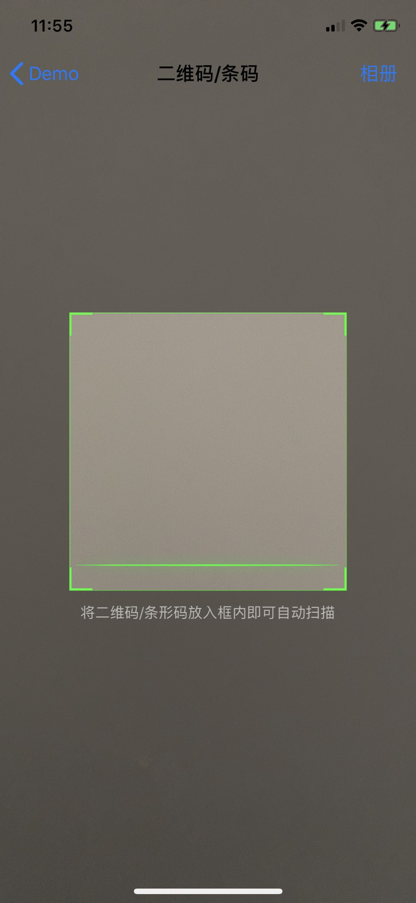
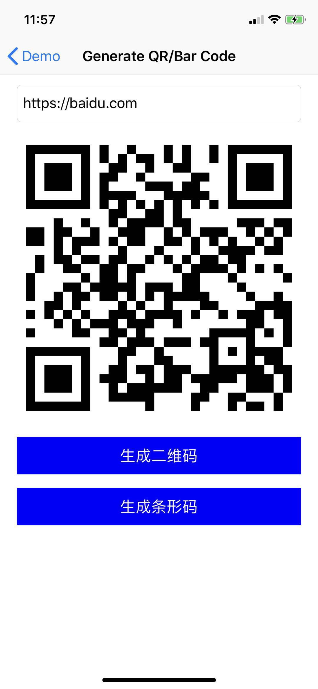

# DBQRCode

轻量版本QRCode、条形码扫面库，基于iOS系统API。

* [苹果QRCode生成官方文档](https://developer.apple.com/library/archive/documentation/GraphicsImaging/Reference/CoreImageFilterReference/index.html#//apple_ref/doc/uid/TP40004346)


## Demo演示

1. `git clone https://github.com/DanboDuan/DBQRCode.git `
2. `cd DBQRCode`
3. `pod install`
4. `open Demo.xcworkspace`





## 要求

* iOS 8.0+
* 相机权限
* 相册权限

## 依赖

* Foundation 
* CoreFoundation 
* UIKit
* AVFoundation 
* CoreImage 
* CoreGraphics 
* QuartzCore

## 使用

1. 直接copy代码，用你的项目prefix重命名文件和类名。
2. pod


```Ruby
pod 'DBQRCode' ,:git => 'https://github.com/DanboDuan/DBQRCode.git',:branch => 'master',:tag => '0.0.1'

```

## 功能

1. QRCode、条形码生成
2. 相机 QRCode、条形码识别
3. 相册 QRCode、条形码识别

**需要真机调试，模拟器无法获取相机权限。**

### 自定义配置

**如示例图展示，可采取默认配置，也可自定义配置如下属性**

* 扫描框size
* 扫描框和扫描线color


## 示例


### 1. QRCode、条形码生成

```Objective-C
dispatch_async(dispatch_get_global_queue(DISPATCH_QUEUE_PRIORITY_DEFAULT, 0), ^{
    UIImage *image = [DBQRCodeManager generateQRCode:@"Your Code" size:yourSize];
    dispatch_async(dispatch_get_main_queue(), ^{
        yourImageView.image = image;
    });
});
```

### 2. 相机 QRCode、条形码识别

**使用SDK内置扫面界面**

```Objective-C
DBQRCodeScanViewController *vc = [[DBQRCodeScanViewController alloc] initWithCallback:^(NSString * _Nullable code, NSError * _Nullable error) {
    NSLog(@"%@",code);
}];
[self.navigationController pushViewController:vc animated:YES];

```

**自定义扫面界面**

```Objective-C
DBQRCodeScanner *scanner = [[DBQRCodeScanner alloc] initWithPreview:yourPreviewView];
[scanner scanWithCallback:^(NSString *code, NSError *error) {
    NSLog(@"%@",code);
    [self.navigationController popViewControllerAnimated:YES];
}];
```

这里的`yourPreviewView`需要实现`DBQRCodePreview`协议，以供scanner回调。也可以直接使用`DBQRCodePreviewView`,进行配置属性即可。

```Objective-C
DBQRCodePreviewView *preView = [[DBQRCodePreviewView alloc] initWithFrame:self.view.bounds];
preView.autoresizingMask = UIViewAutoresizingFlexibleHeight;
self.previewView = preView;
[self.view addSubview:preView];
```

**调用scanner之前请先申请相机权限。如果使用SDK内置界面，会自动申请。**

### 3. 识别相册 QRCode、条形码

```Objective-C
[scanner scanAlbumWithRooter:self callback:^(NSString * _Nullable code, NSError * _Nullable error) {
    NSLog(@"code %@",code);
}];

```

**调用scanner之前请先申请相册权限。如果使用SDK内置界面，会自动申请。**


## 证书

本项目使用[MIT 证书](LICENSE)。详细内容参见[证书](LICENSE)文件。


